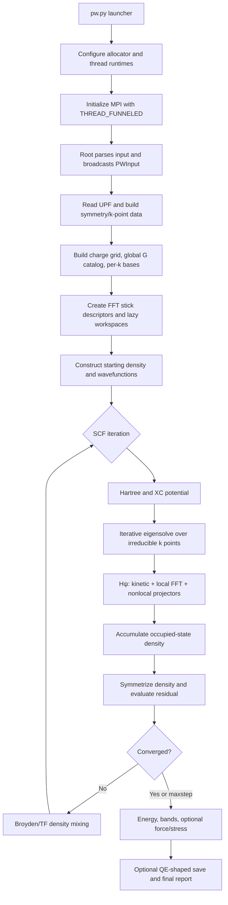

# Architecture

## 1. Design principles

The implementation follows four architectural rules:

1. keep physical equations, algorithm selection, and SCF state transitions in
   readable Python;
2. move only large repeated numerical traversals, FFTs, MPI packing, and
   linear-algebra bridges into Cython or optimized libraries;
3. distribute the arrays that dominate large calculations while avoiding
   unnecessary replicas and temporaries;
4. preserve QE-compatible numerical conventions and fail explicitly when a
   requested physical path is absent.

The result is neither a pure Python prototype nor a transliteration of QE
Fortran. Python owns the model; compiled kernels own the bandwidth- and
latency-sensitive inner work.

## 2. Package map

| Module | Responsibility |
|---|---|
| `launcher.py` | Re-executes the process with allocator and thread-pool controls before NumPy is imported. |
| `cli.py` | MPI-aware input distribution, QE-shaped progress/output, save dispatch, and exit status. |
| `input.py` | Namelist/card parser, lattice construction, k-point generation, symmetry setup, and input validation. |
| `qe_input_schema.py` | QE 7.5 variable-name catalog used to distinguish unknown names from valid but unimplemented options. |
| `upf.py` | UPF parsing, radial interpolation/transforms, local/nonlocal data, atomic orbitals/densities, and NLCC. |
| `basis.py` | Global plane-wave catalogs, per-k bases, FFT grids, stick ownership, transpose descriptors, scratch pools, and local-potential/density FFT workspaces. |
| `_native_fft.pyx` | Mandatory native kernels: FFTW plans, MPI transposes, sparse pack/unpack, Hψ, density accumulation, XC helpers, projector/BLAS bridges, and FFTW-MPI support. |
| `mpi.py` | Communicators, reductions, slab helpers, reusable exchange buffers, shared-memory windows, and root gathers. |
| `diagonalization.py` | Matrix-free Hamiltonian, Davidson, CG, ParO, RMM-DIIS, orthogonalization, and preconditioners. |
| `mixing.py` | Distributed modified-Broyden/Anderson, TF/local-TF, history storage, and periodic Pulay. |
| `occupations.py` | Fixed/smeared occupations, Fermi search, entropy correction, and tetrahedra. |
| `xc.py` | LDA and PBE-family physical formulas with memory-bounded point blocks. |
| `symmetry.py`, `point_group.py` | Space-group/star mappings and scalar-density, force, and stress symmetrization. |
| `ewald.py` | Ewald ion–ion energy, force, and stress. |
| `scf.py` | Top-level setup, SCF loop, potentials, energies, derivatives, memory model, and result construction. |
| `save.py` | QE-shaped XML/HDF5 save and restart data. |
| `output.py` | QE-shaped human-readable setup, iteration, timing, energy, force, stress, and memory reports. |
| `errors.py` | Structured QE-style errors and warnings. |
| `memory.py`, `timing.py`, `threads.py` | Runtime instrumentation and hybrid controls. |

## 3. End-to-end control flow



Only rank zero parses user text and emits ordinary output. Large numerical work
is collective. K points are processed sequentially by the same plane-wave MPI
communicator; there is no pool split.

## 4. Data ownership

### 4.1 Globally shared or replicated small data

Cell, atom, species, k-point, and small control structures are replicated. The
global reciprocal catalog may be placed in one MPI shared-memory window per
node and exposed as a read-only NumPy array to local ranks.

Reduced Hamiltonian/overlap matrices are small compared with wavefunction
blocks. They are MPI-reduced and solved locally rather than distributed with
ScaLAPACK.

### 4.2 Plane waves

For each k point, the cutoff selects a view into one global G-vector catalog.
The global ordering is deterministic and QE-like. In MPI calculations, each
rank owns only plane-wave rows whose complete z stick belongs to that rank.
Wavefunction coefficient matrices therefore have shape approximately

```text
(local plane-wave rows, bands or current solver block)
```

and are Fortran-oriented where BLAS column operations dominate.

### 4.3 Real-space density and potential

The dense real grid is decomposed into contiguous z slabs:

```text
(nr1, nr2, local_nr3)
```

for Python-facing scalar fields. The native FFT workspace uses
`(local_nr3, nr1, nr2, 1)` so each local xy plane is contiguous for FFTW.
Charge-density coefficients use a compact distributed reciprocal-row basis.

### 4.4 Symmetry

Symmetry operations themselves are small and replicated. Reciprocal star maps,
phases, destinations, and compact indices are built for the local charge rows.
The scalar projector accumulates star averages without allocating one density
grid per operation.

## 5. Plane-wave catalog and per-k bases

`PlaneWaveCatalog` stores one cutoff-bounded set of integer Miller indices,
Cartesian G vectors, and kinetic norms large enough for every active k point.
`PlaneWaveBasis` stores compact indices selecting the rows that satisfy
$|k+G|^2/2\le E_{\mathrm{cut}}$.

This arrangement avoids retaining a complete integer/vector table for every
irreducible k point. Per-k workspaces are created lazily and keep only
operational mappings needed on later SCF iterations.

## 6. FFT descriptor and persistent stick ownership

`FFTGridDescriptor` is shared by all workspaces with the same grid and
communicator size. Construction proceeds as follows:

1. map every reciprocal row to its periodic `(Gx,Gy)` pair;
2. identify unique complete z sticks and count active G rows on each;
3. sort sticks by decreasing active-row count;
4. assign each stick greedily to the rank with the smallest G load, using
   stick count as a tie breaker;
5. store `stick_owners`, processor-ordered stick lists, global-to-stick lookup,
   row z slots, and row stick indices;
6. build one rank-local transpose plan containing exact peer counts,
   displacements, and real-slab destination points.

The ownership does not change between Hamiltonian applications. This mirrors
the central load-balancing principle of QE FFTXlib and avoids redistributing
sparse coefficients merely to satisfy a different FFT library layout.

## 7. Distributed local-potential kernel


The forward send buffer is the stick workspace itself. After the slab payload
has been consumed, the forward receive allocation can be reused as the reverse
send buffer when sizes match. The reverse collective receives directly into
the original stick workspace. Thus the low-memory path needs one stick array,
one one-band slab, and the two grow-only MPI exchange capacities rather than
separate arrays for every stage.

Exact-count `MPI_Alltoallv` was selected over QE-style fixed-count padding.
Persistent MPI-4 collective requests and adaptive `FFTW_MEASURE` promotion were
experimented with but removed because they did not improve the controlled
multi-rank workload.

## 8. FFTW plans and FFTW-MPI

`FFTScratchPool` owns aligned complex allocations and plan objects keyed by
geometry, strides, threads, planner flag, and data pointer. A plan is valid
only while its owner allocation remains at the same address. If a grow-only
buffer is replaced by a larger allocation, plans attached to the old pointer
are removed.

Serial long-lived shapes may use measured plans when their reuse amortizes
planning. MPI paths default conservatively to estimate planning because
Davidson block widths and first-call costs can make global measurement slower
overall.

The extension can create FFTW-MPI dense three-dimensional plans when linked to
`libfftw3_mpi`. Their allocation and roundtrip are tested. They do not replace
the stick Hψ path because standard FFTW-MPI owns reciprocal slabs and would
require another transpose to restore sparse stick ownership.

Both ordinary and FFTW-MPI plan classes retain their NumPy owner and destroy
forward/backward native plans during deallocation.

## 9. Matrix-free Hamiltonian

`PlaneWaveHamiltonian` exposes block application and application-into-existing-
output interfaces. It combines:

- a diagonal kinetic term;
- the distributed/serial pseudospectral local potential;
- factorized or packed nonlocal projector terms.

The iterative solvers never materialize the full $N_{PW}\times N_{PW}$
Hamiltonian. Large matrix products are delegated to BLAS, projector phase and
coupling structure is reused, and caller-provided outputs reduce allocation
high water. The dense path is isolated as a diagnostic option.

## 10. Eigensolver workspace lifetimes

Davidson retains basis and applied-basis blocks up to the configured subspace
limit. Ritz vectors and residuals are released or overwritten before the next
expansion high-water point where possible. CG uses a fixed number of vector
workspaces. ParO uses QE's bounded 1.5N Ritz block plus the five-step `bpcg_k`
correction workspaces. RMM stores
`(vector, Hvector)` history of dimension `diago_rmm_ndim` and constructs only
small residual Gram matrices.

The SCF driver processes one k point at a time. Converged coefficients required
for density/output are retained in compact local-row form, but current-k
Davidson temporaries are released before moving to the next k point.

## 11. Density, potential, and mixing lifetimes

The SCF high-water model allows a bounded set of rank-local real arrays for
ionic, Hartree, XC, effective, input/output, core, and energy/mixing roles.
Where lifetimes do not overlap, an existing real grid is reused.

GGA pointwise formulas are evaluated in cache-sized blocks, so PW92/PBE
intermediate arrays do not scale as many extra full grids. Spectral gradients
reuse the FFT scratch pool.

The distributed Broyden mixer stores input and residual differences only on
locally owned active charge rows. It forms Coulomb-metric Gram matrices with
one vector-sized weighted temporary and MPI-reduces only the small matrices.

## 12. Native boundary

The Cython module contains no high-level choice of functional, occupation mode,
or solver. Python passes explicit arrays and parameters to native kernels. The
native side performs:

- typed contiguous traversal and compact-index decoding;
- FFTW plan creation/execution;
- MPI `Alltoallv` on raw complex buffers;
- sparse stick/slab packing;
- fused potential multiplication, kinetic addition, and density accumulation;
- projector, norm, preconditioner, and selected XC elementwise kernels;
- direct BLAS/LAPACKE calls when compatible symbols are available.

This keeps physical policy reviewable in Python while removing Python loops
from operations proportional to plane waves, grid points, bands, or projector
columns.

## 13. Hybrid threading

MPI is funneled: only the main thread enters collectives. OpenMP parallelizes
independent rows, planes, sticks, or bands inside native regions. FFTW either
executes a batched plan or one plan per independent transform inside an outer
OpenMP team, depending on workload and thread count.

BLAS is restricted to one thread in multi-rank runs to prevent `ranks × BLAS
threads × OpenMP threads` oversubscription. This policy also reduces persistent
per-rank worker stacks and runtime control blocks.

## 14. Memory accounting and allocator control

The source-level estimator tracks the principal NumPy/native-owner allocations
and expected workspace overlap. MPI exchange buffers and FFT scratch are
grow-only: they expand to the largest requested shape and are reused rather
than repeatedly allocated.

The launcher sets one glibc arena per rank and small OpenMP stacks before
loading native libraries. `malloc_trim(0)` is called at coarse lifetime
boundaries such as after temporary UPF/header work and after large solver
phases. Trimming is deliberately not placed in inner loops.

Node-shared read-only arrays use `MPI.Win.Allocate_shared`; measured aggregate
PSS apportions those pages rather than counting a full copy in each rank.

## 15. Save and restart architecture

When saving is enabled, rank-local wavefunction rows are gathered or serialized
into QE-shaped HDF5 datasets and the root writes XML metadata. Save-only full
arrays are created after major SCF temporaries have been released where
possible. `disk_io='none'` skips this phase entirely.

Restart reads density directly onto the current compact reciprocal basis and
maps saved wavefunctions onto compatible current G rows. Geometry, cutoff,
k-point, band, and shape mismatches are diagnosed rather than silently
interpolated.

## 16. Extension points

New physics should normally be added in this order:

1. define the physical expression and supported input boundary in Python;
2. add reference/unit tests and memory-lifetime expectations;
3. implement a clear NumPy version or orchestration path;
4. move only the measured large traversal into Cython;
5. preserve caller-owned outputs and distributed ownership;
6. validate serial, MPI, symmetry, and `nosym` paths;
7. retain the optimization only if wall time or memory improves without an
   unintended regression in the other.

Adding another backend selector is discouraged when the production path can be
selected automatically from build capabilities and measured suitability.
